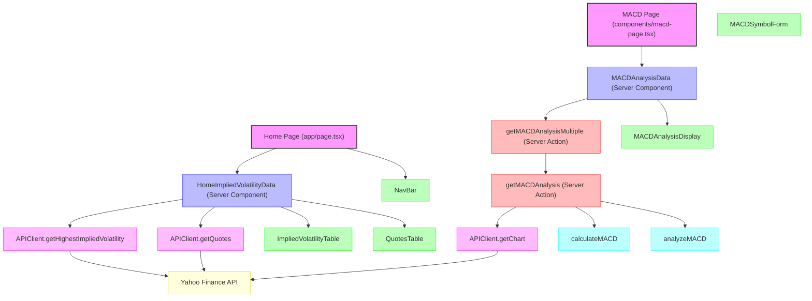

# Stock Screener Application Architecture

## Data Flow

### Home Page

1. The Home Page renders with a NavBar and a Suspense boundary for the HomeImpliedVolatilityData server component
2. HomeImpliedVolatilityData fetches:
    - Highest implied volatility stocks using APIClient.getHighestImpliedVolatility
    - Stock quotes for those symbols using APIClient.getQuotes
3. The data is passed to ImpliedVolatilityTable and QuotesTable components for display

### MACD Page

1. The MACD Page renders with a Suspense boundary for the MACDAnalysisData server component
2. MACDAnalysisData calls getMACDAnalysisMultiple server action
3. getMACDAnalysisMultiple calls getMACDAnalysis for each symbol in parallel
4. getMACDAnalysis:
    - Fetches historical data using APIClient.getChart
    - Calculates MACD indicators using calculateMACD utility
    - Analyzes MACD signals using analyzeMACD utility
5. The analysis results are passed to MACDAnalysisDisplay components for visualization

## API Endpoints Used

1. `/api/market/get-highest-implied-volatility` - Fetches stocks with highest implied volatility
2. `/api/market/get-quote-v2` - Fetches stock quotes for multiple symbols
3. `/api/stock/get-chart` - Fetches historical price data for MACD analysis

## Current Implementation Notes

- The application is currently using fixture data instead of live API calls (commented out in the code)
- MACD analysis functionality is implemented but commented out on the Home Page
- The application uses Next.js 15.3.1 with Server Components for data fetching
