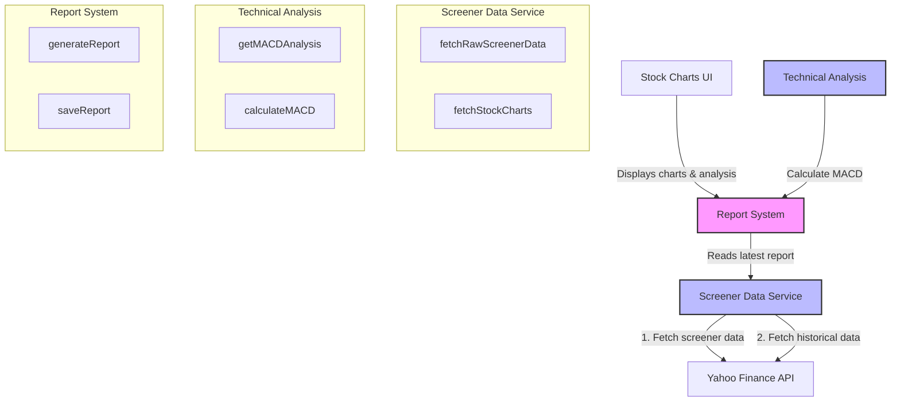

## Architecture Overview

### Core Components

1. **Stock Charts UI**
   - Displays stock charts and technical analysis
   - Uses Server Components for data fetching
   - Built with Next.js and Tailwind CSS

2. **Screener Data Service**
   - Fetches and combines stock screener data
   - Manages report caching and data limits
   - Key functions:
     - `fetchRawScreenerData`: Gets raw screener results
     - `fetchStockCharts`: Gets historical price data

3. **Technical Analysis**
   - Calculates technical indicators (MACD)
   - Analyzes price movements and trends
   - Key functions:
     - `getMACDAnalysis`: Analyzes MACD for a symbol
     - `calculateMACD`: Core MACD calculation

4. **Report System**
   - Manages JSON report generation and storage
   - Caches data to reduce API calls
   - Key functions:
     - `generateReport`: Creates new stock reports
     - `saveReport`: Persists reports to filesystem

### Data Flow

1. UI reads latest report data through Server Components
2. Report system orchestrates data fetching and analysis
3. Screener service fetches both:
   - Stock screener results (top market cap stocks)
   - Historical price data for analysis
4. Technical analysis calculates indicators
5. Results are cached as JSON reports

### Key Features

- Server-side rendering and data fetching
- Report-based caching system
- Technical analysis with MACD
- Responsive chart display
- Error handling and fallbacks
